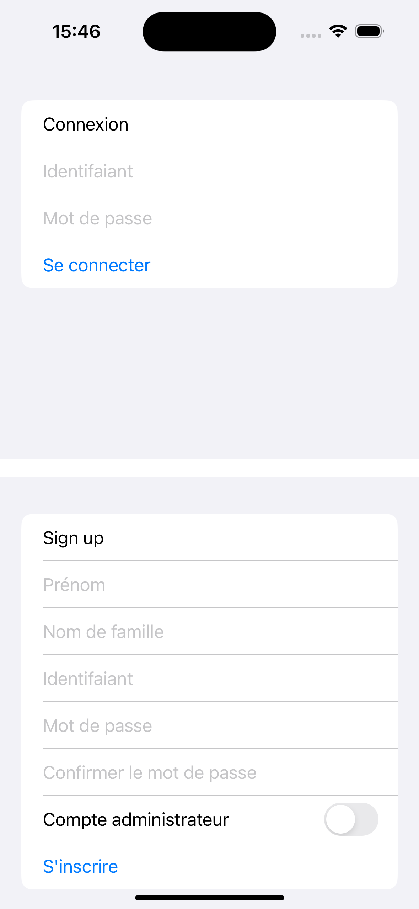
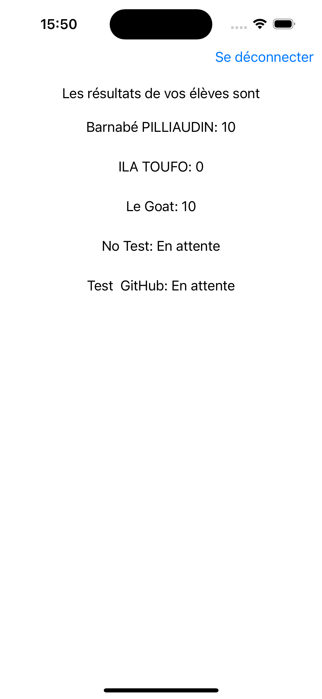

# Examen Barnabé PILLIAUDIN

## Comment utiliser

Ouvrez le dossier l'application dans XCode. Faites cmd + R pour lancer l'application.

- Dans un premier temps créez vous un compte adminstrateur en activant le toggle
- Déconnectez vous et créez vous un compte utilisateur en décochant le toggle
- Répondez aux questions en cliquant sur la réponse de votre choix
- A la fin du questionnaire, vous verrez votre score et déconnectez vous
- Conenctez vous au compte adminstrateur pour voir les résultats des utilisateurs

Si vous vous reconnectez au compte utilisateur, vous ne pourrez pas refaire le questionnaire.

## Screenshots

### Page de connexion

### Exemple de question

### Admin Dashboard

